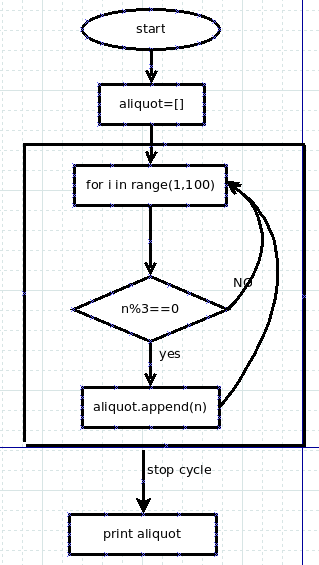

>"But be on your guard so that your hearts are not wighted down with dissipation and drunkenness and the worries of this life, and that day close down upon you suddenly like a trap. For it will overtake all who live on the face of the whole earht. But staty alert at all times, praying that you may have strength to eacape all these things that must happen, and to stand before the Son of Man."

>你们要谨慎，恐怕因贪食醉酒并今生的思虑，累住你们的心，那日子就如同网罗忽然临到你们。因为那日子要这样临到全地上一切居住的人。你们要是是儆醒，常常祈求，是你们能逃避这一切要来的事，得以站立在人子面前。(LUKE 21:34-36)

#语句(3)

循环，也是现实生活中常见的现象，我们常说日复一日，就是典型的循环。又如：日月更迭，斗转星移，无不是循环；王朝更迭；子子孙孙，繁衍不息，从某个角度看也都是循环。

编程语言就是要解决现实问题的，因此也少不了要循环。

在python中，循环有一个语句：for语句。

其基本结构是：

    for 循环规则：
        操作语句

从这个基本结构看，有着同if条件语句类似的地方：都有冒号；语句块都要缩进。是的，这是不可或缺的。

##简单的for循环例子

前面介绍print语句的时候，出现了一个简单例子。重复一个类似的：

    >>> hello = "world"
    >>> for i in hello:
    ...     print i
    ... 
    w
    o
    r
    l
    d

这个for循环是怎么工作的呢？

1. hello这个变量引用的是"world"这个str类型的数据
2. 变量 i 通过hello找到它所引用的对象"world",因为str类型的数据属于序列类型，能够进行索引，于是就按照索引顺序，从第一字符开始，依次获得该字符的引用。
3. 当 i="w"的时候，执行print i，打印出了字母w，结束之后循环第二次，让 i="e"，然后执行print i,打印出字母e，如此循环下去，一直到最后一个字符被打印出来，循环自动结束。注意，每次打印之后，要换行。如果不想换行，怎么办？参见[《语句(1)》](./121.md)中关于print语句。

因为可以也通过使用索引（偏移量），得到序列对象的某个元素。所以，还可以通过下面的循环方式实现同样效果：

    >>> for i in range(len(hello)):
    ...     print hello[i]
    ... 
    w
    o
    r
    l
    d

其工作方式是：

1. len(hello)得到hello引用的字符串的长度，为5
2. range(len(hello),就是range(5),也就是[0, 1, 2, 3, 4],对应这"world"每个字母索引，也可以称之为偏移量。这里应用了一个新的函数`range()`，关于它的用法，继续阅读，就能看到了。
3. for i in range(len(hello)),就相当于for i in [0,1,2,3,4],让i依次等于list中的各个值。当i=0时，打印hello[0]，也就是第一个字符。然后顺序循环下去，直到最后一个i=4为止。

以上的循环举例中，显示了对str的字符依次获取，也涉及了list，感觉不过瘾呀。那好，看下面对list的循环：

    >>> ls_line
    ['Hello', 'I am qiwsir', 'Welcome you', '']
    >>> for word in ls_line:
    ...     print word
    ... 
    Hello
    I am qiwsir
    Welcome you

    >>> for i in range(len(ls_line)):
    ...     print ls_line[i]
    ... 
    Hello
    I am qiwsir
    Welcome you

##range(start,stop[, step])

这个内建函数，非常有必要给予说明，因为它会经常被使用。一般形式是`range(start, stop[, step])`

要研究清楚一些函数特别是内置函数的功能，建议看官首先要明白内置函数名称的含义。因为在python中，名称不是随便取的，是代表一定意义的。所谓：名不正言不顺。

>range

>n. 范围；幅度；排；山脉
>vi. （在...内）变动；平行，列为一行；延伸；漫游；射程达到
>vt. 漫游；放牧；使并列；归类于；来回走动

在具体实验之前，还是按照管理，摘抄一段[官方文档的原话](https://docs.python.org/2/library/functions.html#range)，让我们能够深刻理解之：

>This is a versatile function to create lists containing arithmetic progressions. It is most often used in for loops. The arguments must be plain integers. If the step argument is omitted, it defaults to 1. If the start argument is omitted, it defaults to 0. The full form returns a list of plain integers [start, start + step, start + 2 * step, ...]. If step is positive, the last element is the largest start + i * step less than stop; if step is negative, the last element is the smallest start + i * step greater than stop. step must not be zero (or else ValueError is raised).

从这段话，我们可以得出关于`range()`函数的以下几点：

- 这个函数可以创建一个数字元素组成的列表。
- 这个函数最常用于for循环（关于for循环，马上就要涉及到了）
- 函数的参数必须是整数，默认从0开始。返回值是类似[start, start + step, start + 2*step, ...]的列表。
- step默认值是1。如果不写，就是按照此值。
- 如果step是正数，返回list的最最后的值不包含stop值，即start+i*step这个值小于stop；如果step是负数，start+i*step的值大于stop。
- step不能等于零，如果等于零，就报错。

在实验开始之前，再解释range(start,stop[,step])的含义：

- start：开始数值，默认为0,也就是如果不写这项，就是认为start=0
- stop：结束的数值，必须要写的。
- step：变化的步长，默认是1,也就是不写，就是认为步长为1。坚决不能为0

实验开始，请以各项对照前面的讲述：

    >>> range(9)                #stop=9，别的都没有写，含义就是range(0,9,1)
    [0, 1, 2, 3, 4, 5, 6, 7, 8] #从0开始，步长为1,增加，直到小于9的那个数 
    >>> range(0,9)
    [0, 1, 2, 3, 4, 5, 6, 7, 8]
    >>> range(0,9,1)
    [0, 1, 2, 3, 4, 5, 6, 7, 8]
    
    >>> range(1,9)              #start=1
    [1, 2, 3, 4, 5, 6, 7, 8]

    >>> range(0,9,2)            #step=2,每个元素等于start+i*step，
    [0, 2, 4, 6, 8]

仅仅解释一下range(0,9,2)

- 如果是从0开始，步长为1,可以写成range(9)的样子，但是，如果步长为2，写成range(9,2)的样子，计算机就有点糊涂了，它会认为start=9,stop=2。所以，在步长不为1的时候，切忌，要把start的值也写上。
- start=0,step=2,stop=9.list中的第一个值是start=0,第二个值是start+1*step=2（注意，这里是1，不是2，不要忘记，前面已经讲过，不论是list还是str，对元素进行编号的时候，都是从0开始的），第n个值就是start+(n-1)*step。直到小于stop前的那个值。

熟悉了上面的计算过程，看看下面的输入谁是什么结果？

    >>> range(-9)

我本来期望给我返回[0,-1,-2,-3,-4,-5,-6,-7,-8],我的期望能实现吗？

分析一下，这里start=0,step=1,stop=-9.

第一个值是0；第二个是start+1*step，将上面的数代入，应该是1,但是最后一个还是-9，显然出现问题了。但是，python在这里不报错，它返回的结果是：

    >>> range(-9)
    []
    >>> range(0,-9)
    []
    >>> range(0)
    []
    
报错和返回结果，是两个含义，虽然返回的不是我们要的。应该如何修改呢？

    >>> range(0,-9,-1)
    [0, -1, -2, -3, -4, -5, -6, -7, -8]
    >>> range(0,-9,-2)
    [0, -2, -4, -6, -8]

有了这个内置函数，很多事情就简单了。比如：

    >>> range(0,100,2)
    [0, 2, 4, 6, 8, 10, 12, 14, 16, 18, 20, 22, 24, 26, 28, 30, 32, 34, 36, 38, 40, 42, 44, 46, 48, 50, 52, 54, 56, 58, 60, 62, 64, 66, 68, 70, 72, 74, 76, 78, 80, 82, 84, 86, 88, 90, 92, 94, 96, 98]

100以内的自然数中的偶数组成的list，就非常简单地搞定了。

思考一个问题，现在有一个列表，比如是["I","am","a","pythoner","I","am","learning","it","with","qiwsir"],要得到这个list的所有序号组成的list，但是不能一个一个用手指头来数。怎么办？

请沉思两分钟之后，自己实验一下，然后看下面。

    >>> pythoner
    ['I', 'am', 'a', 'pythoner', 'I', 'am', 'learning', 'it', 'with', 'qiwsir']
    >>> py_index = range(len(pythoner))     #以len(pythoner)为stop的值
    >>> py_index
    [0, 1, 2, 3, 4, 5, 6, 7, 8, 9]

再用手指头指着pythoner里面的元素，数一数，是不是跟结果一样。

**例：**找出100以内的能够被3整除的正整数。

**分析：**这个问题有两个限制条件，第一是100以内的正整数，根据前面所学，可以用range(1,100)来实现；第二个是要解决被3整除的问题，假设某个正整数n，这个数如果能够被3整除，也就是n%3(%是取余数)为0.那么如何得到n呢，就是要用for循环。

以上做了简单分析，要实现流程，还需要细化一下。按照前面曾经讲授过的一种方法，要画出问题解决的流程图。

下面写代码就是按图索骥了。

代码：

	#! /usr/bin/env python
	#coding:utf-8
	
	aliquot = []
	
	for n in range(1,100):
	    if n%3 == 0:
	        aliquot.append(n)
	
	print aliquot

代码运行结果：

    [3, 6, 9, 12, 15, 18, 21, 24, 27, 30, 33, 36, 39, 42, 45, 48, 51, 54, 57, 60, 63, 66, 69, 72, 75, 78, 81, 84, 87, 90, 93, 96, 99]

上面的代码中，将for循环和if条件判断都用上了。

不过，感觉有点麻烦，其实这么做就可以了：

    >>> range(3,100,3)
    [3, 6, 9, 12, 15, 18, 21, 24, 27, 30, 33, 36, 39, 42, 45, 48, 51, 54, 57, 60, 63, 66, 69, 72, 75, 78, 81, 84, 87, 90, 93, 96, 99]

##能够用来for的对象

所有的序列类型对象，都能够用for来循环。比如：

    >>> name_str = "qiwsir"
    >>> for i in name_str:  #可以对str使用for循环
    ...     print i,
    ...                     
    q i w s i r

    >>> name_list = list(name_str)
    >>> name_list
    ['q', 'i', 'w', 's', 'i', 'r']
    >>> for i in name_list:     #对list也能用
    ...     print i,
    ... 
    q i w s i r

    >>> name_set = set(name_str)    #set还可以用
    >>> name_set
    set(['q', 'i', 's', 'r', 'w'])
    >>> for i in name_set:
    ...     print i,
    ... 
    q i s r w

    >>> name_tuple = tuple(name_str)
    >>> name_tuple
    ('q', 'i', 'w', 's', 'i', 'r')
    >>> for i in name_tuple:        #tuple也能呀
    ...     print i,
    ... 
    q i w s i r

    >>> name_dict={"name":"qiwsir","lang":"python","website":"qiwsir.github.io"}
    >>> for i in name_dict:             #dict也不例外，这里本质上是将字典的键拿出来，成为序列后进行循环
    ...     print i,"-->",name_dict[i]
    ... 
    lang --> python
    website --> qiwsir.github.io
    name --> qiwsir

在用for来循环读取字典键值对上，需要多说几句。

有这样一个字典：
    
    >>> a_dict = {"name":"qiwsir", "lang":"python", "email":"qiwsir@gmail.com", "website":"www.itdiffer.com"}

曾记否？在[《字典(2)](./117.md)中有获得字典键、值的函数：items/iteritems/keys/iterkeys/values/itervalues，通过这些函数得到的是键或者值的列表。
    
    >>> for k in a_dict.keys():
    ...     print k, a_dict[k]
    ... 
    lang python
    website www.itdiffer.com
    name qiwsir
    email qiwsir@gmail.com
    
这是最常用的一种获得字典键/值对的方法，而且效率也不错。

    >>> for k,v in a_dict.items():
    ...     print k,v
    ... 
    lang python
    website www.itdiffer.com
    name qiwsir
    email qiwsir@gmail.com

    >>> for k,v in a_dict.iteritems():
    ...     print k,v
    ... 
    lang python
    website www.itdiffer.com
    name qiwsir
    email qiwsir@gmail.com
    
这两种方法也能够实现同样的效果，但是因为有了上面的方法，一般就少用了。但是，用也无妨，特别是第二个`iteritems()`，效率也是挺高的。

但是，要注意下面的方法：

    >>> for k in a_dict.keys():
    ...     print k, a_dict[k]
    ... 
    lang python
    website www.itdiffer.com
    name qiwsir
    email qiwsir@gmail.com

这种方法其实是不提倡的，虽然实现了同样的效果，但是效率常常是比较低的。切记。

    >>> for v in a_dict.values():
    ...     print v
    ... 
    python
    www.itdiffer.com
    qiwsir
    qiwsir@gmail.com

    >>> for v in a_dict.itervalues():
    ...     print v
    ... 
    python
    www.itdiffer.com
    qiwsir
    qiwsir@gmail.com

单独取values，推荐第二种方法。

------

[总目录](./index.md)&nbsp;&nbsp;&nbsp;|&nbsp;&nbsp;&nbsp;[上节：语句(2)](./122.md)&nbsp;&nbsp;&nbsp;|&nbsp;&nbsp;&nbsp;[下节：语句(4)](./124.md)

如果你认为有必要打赏我，请通过支付宝：**qiwsir@126.com**,不胜感激。