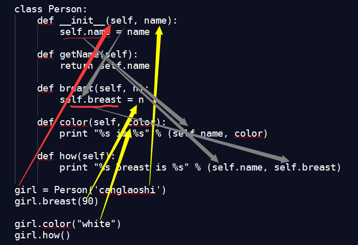
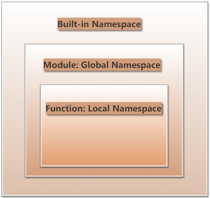

>世人凭自己的智慧，既不认识神，神就乐意用人所当作愚拙的道理拯救那些信的人，这就是神的智慧了。犹太人是要神迹，希腊人是求智慧；我们却是传钉十字架的基督。(1 CORINTHIANS 2:21-22)

#类(3)

在上一节中，对类有了基本的或者说是模糊的认识，为了能够对类有更深刻的认识，本节要深入到一些细节。

##类属性和实例属性

正如上节的案例中，一个类实例化后，实例是一个对象，有属性。同样，类也是一个对象，它也有属性。

    >>> class A(object):
    ...     x = 7
    ... 

在交互模式下，定义一个很简单的类（注意观察，有`(object)`，是新式类），类中有一个变量`x = 7`，当然，如果愿意还可以写别的。因为一下操作中，只用到这个，我就不写别的了。
    
    >>> A.x
    7
    
在类A中，变量x所引用的数据，能够直接通过类来调用。或者说x是类A的属性，这种属性有一个名称，曰“类属性”。类属性仅限于此——类中的变量。它也有其他的名字，如静态数据。

    >>> foo = A()
    >>> foo.x
    7
    
实例化，通过实例也可以得到这个属性，这个属性叫做“实例属性”。对于同一属性，可以用类来访问（类属性），在一般情况下，也可以通过实例来访问同样的属性。但是：

    >>> foo.x += 1
    >>> foo.x
    8
    >>> A.x
    7
    
实例属性更新了，类属性没有改变。这至少说明，类属性不会被实例属性左右，也可以进一步说“类属性与实例属性无关”。那么，`foo.x += 1`的本质是什么呢？其本质是该实例foo又建立了一个新的属性，但是这个属性（新的foo.x）居然与原来的属性（旧的foo.x）重名，所以，原来的foo.x就被“遮盖了”，只能访问到新的foo.x，它的值是8.

    >>> foo.x
    8
    >>> del foo.x
    >>> foo.x
    7
    
既然新的foo.x“遮盖”了旧的foo.x，如果删除它，旧的不久显现出来了？的确是。删除之后，foo.x就还是原来的值。此外，还可以通过建立一个不与它重名的实例属性：

    >>> foo.y = foo.x + 1
    >>> foo.y
    8
    >>> foo.x
    7

foo.y就是新建的一个实例属性，它没有影响原来的实例属性foo.x。

但是，类属性能够影响实例属性，这点应该好理解，因为实例就是通过实例化调用类的。

    >>> A.x += 1
    >>> A.x
    8
    >>> foo.x
    8

这时候实例属性跟着类属性而改变。

以上所言，是指当类中变量引用的是不可变数据。如果类中变量引用可变数据，情形会有所不同。因为可变数据能够进行原地修改。

    >>> class B(object):
    ...     y = [1,2,3]
    ...

这次定义的类中，变量引用的是一个可变对象。
    
    >>> B.y         #类属性
    [1, 2, 3]
    >>> bar = B()
    >>> bar.y       #实例属性
    [1, 2, 3]

    >>> bar.y.append(4)
    >>> bar.y
    [1, 2, 3, 4]
    >>> B.y
    [1, 2, 3, 4]

    >>> B.y.append("aa")
    >>> B.y
    [1, 2, 3, 4, 'aa']
    >>> bar.y
    [1, 2, 3, 4, 'aa']

从上面的比较操作中可以看出，当类中变量引用的是可变对象是，类属性和实例属性都能直接修改这个对象，从而影响另一方的值。

对于类属性和实例属性，除了上述不同之外，在下面的操作中，也会有差异。

    >>> foo = A()
    >>> dir(foo)
    ['__class__', '__delattr__', '__dict__', '__doc__', '__format__', '__getattribute__', '__hash__', '__init__', '__module__', '__new__', '__reduce__', '__reduce_ex__', '__repr__', '__setattr__', '__sizeof__', '__str__', '__subclasshook__', '__weakref__', 'x']

实例化类A，可以查看其所具有的属性（看最后一项，x），当然，执行`dir(A)`也是一样的。

    >>> A.y = "hello"
    >>> foo.y
    'hello'

增加一个类属性，同时在实例属性中也增加了一样的名称和数据的属性。如果增加通过实例增加属性呢？看下面：
    
    >>> foo.z = "python"
    >>> foo.z
    'python'
    >>> A.z
    Traceback (most recent call last):
      File "<stdin>", line 1, in <module>
    AttributeError: type object 'A' has no attribute 'z'
    
类并没有收纳这个属性。这进一步说明，类属性不受实例属性左右。另外，在类确定或者实例化之后，也可以增加和修改属性，其方法就是通过类或者实例的点号操作来实现，即`object.attribute`，可以实现对属性的修改和增加。

##数据流转

在类的应用中，最广泛的是将类实例化，通过实例来执行各种方法。所以，对此过程中的数据流转一定要弄明白。

回顾上节已经建立的那个类，做适当修改，并请出"canglaoshi"。但是，我将注释删除，读者是否能够写上必要的注释呢？如果你把注释写上，就已经理解了类的基本结构。

    #!/usr/bin/env python
    # coding=utf-8

    __metaclass__ = type

    class Person:
        def __init__(self, name):
            self.name = name

        def getName(self):
            return self.name
    
        def breast(self, n):
            self.breast = n
        
        def color(self, color):
            print "%s is %s" % (self.name, color)

        def how(self):
            print "%s breast is %s" % (self.name, self.breast)

    girl = Person('canglaoshi')
    girl.breast(90)

    girl.color("white")
    girl.how()

运行后结果：

    $ python 20701.py 
    canglaoshi is white
    canglaoshi breast is 90
    
一图胜千言，有图有真相。通过图示，我们看一看数据的流转过程。

创建实例`girl = Person('canglaoshi')`，注意观察图上的箭头方向。girl这个实例和Person类中的self对应，这正是应了上节所概括的“实例变量与self对应，实例变量主外，self主内”的概括。"canglaoshi"是一个具体的数据，通过初始化函数中的name参数，传给self.name，前面已经讲过，self也是一个实例，可以为它设置属性，`self.name`就是一个属性，经过初始化函数，这个属性的值由参数name传入，现在就是"canglaoshi"。

在类Person的其它方法中，都是以self为第一个或者唯一一个参数。注意，在python中，这个参数要显明写上，在类内部是不能省略的。这就表示所有方法都承接self实例对象，它的属性也被带到每个方法之中。例如在方法里面使用`self.name`即是调用前面已经确定的实例属性数据。当然，在方法中，还可以继续为实例self增加属性，比如`self.breast`。这样，通过self实例，就实现了数据在类内部的流转。

如果要把数据从类里面传到外面，可以通过`return`语句实现。如上例子中所示的`getName`方法。

因为实例名称(girl)和self是对应关系，实际上，在类里面也可以用girl代替self。例如，做如下修改：

    #!/usr/bin/env python
    # coding=utf-8

    __metaclass__ = type

    class Person:
        def __init__(self, name):
            self.name = name

        def getName(self):
            #return self.name
            return girl.name    #修改成这个样子，但是在编程实践中不要这么做。

    girl = Person('canglaoshi')
    name = girl.getName()
    print name

运行之后，打印：

    canglaoshi

这个例子说明，在实例化之后，实例变量girl和函数里面的那个self实例是完全对应的。但是，提醒读者，千万不要用上面的修改了的那个方式。因为那样写使类没有独立性，这是大忌。

##命名空间

命名空间，英文名字：namespaces。在研究类或者面向对象编程中，它常常被提到。

在研习命名空间以前，请打开在python的交互模式下，输入：import this

    >>> import this
    The Zen of Python, by Tim Peters

    Beautiful is better than ugly.
    Explicit is better than implicit.
    Simple is better than complex.
    Complex is better than complicated.
    Flat is better than nested.
    Sparse is better than dense.
    Readability counts.
    Special cases aren't special enough to break the rules.
    Although practicality beats purity.
    Errors should never pass silently.
    Unless explicitly silenced.
    In the face of ambiguity, refuse the temptation to guess.
    There should be one-- and preferably only one --obvious way to do it.
    Although that way may not be obvious at first unless you're Dutch.
    Now is better than never.
    Although never is often better than *right* now.
    If the implementation is hard to explain, it's a bad idea.
    If the implementation is easy to explain, it may be a good idea.
    Namespaces are one honking great idea -- let's do more of those!

这里列位看到的就是所谓《python之禅》，请看最后一句： Namespaces are one honking great idea -- let's do more of those!

这是为了向看官说明Namespaces、命名空间值重要性。

###什么是命名空间

从“一切皆为对象”开始说起吧。对象，很多时候我们直接使用它并不方便，因此要给它取一个名字。打个比方，有这样一个物种，它是哺乳纲灵长目人科人属智人种，这就是所谓的对象，但是，在平时提及这个对象的时候，总是要说“哺乳纲灵长目人科人属智人种”，是不是太麻烦了？于是聪明的这个物种就为这个世界上的各种对象命名，例如将“哺乳纲灵长目人科人属智人种”这个对象命名为“人”。

在编程中也是如此，前面在讲述变量相关知识的时候已经说明了变量和引用对象的关系。

    >>> a = 7
    >>> id(7)
    137589400
    >>> id(a)
    137589400
    >>> id(7) == id(a)
    True

看这个例子。7就是一个计算机内存中存在的对象，用id()这个内置函数可以查看7在内存（在RAM）中的地址。a 就是为这个对象预备的名字，如前面所讲的，它与内存中的一个编号为137589400的对象关联，或者说引用了这个对象，这个对象就是7.

如果做了下面的操作：

    >>> a = a + 1
    >>> id(a)
    137589388
    >>> a
    8
    >>> id(8)
    137589388

其实，上面操作中的`a + 1`完成的是a引用的对象`7+1`，只不过是顺着对象7的命名a导入了对象7罢了，这样就在内存中建立了一个新的对象8，同样通过id()函数查看到内存中的地址，通过地址可以看到，这时候的a又自动引用对象8了.

    >>> id(7)   #对象7在内存中的地址没变
    137589400
    >>> b = 7   #b引用此对象
    >>> id(b)   
    137589400

上面a转换引用对象的过程，是自动完成的。而当b=7的时候，并不是在内存中从新建立一个对象7,而是b引用了已有的对象。这就是python的所谓动态语言的特点。

当然，可以给任何对象取名字，或者说为任何对象都可以建立一个所引用的变量。比如函数、类都可以，此处不赘述，前面已经多次用到了。

现在已经又一次明确了，每个名称（命名）——英文中的NAME有动词和名字两种，所以，由于中文的特点，似乎怎么说都可以，只要明白所指，因为中文是强调语境的语言——都与某个对象有对应关系。那么所谓的**命名空间，就是这些命名（名称）的集合，它们分别与相应的对象有对应关系。**

用一句比较学术化的语言说：

**命名空间是从所定义的命名到对象的映射集合。**

不同的命名空间，可以同时存在，当彼此相互独立互不干扰。

命名空间因为对象的不同，也有所区别，可以分为如下几种：

- 内置命名空间(Built-in Namespaces)：Python运行起来，它们就存在了。内置函数的命名空间都属于内置命名空间，所以，我们可以在任何程序中直接运行它们，比如前面的id(),不需要做什么操作，拿过来就直接使用了。
- 全局命名空间(Module:Global Namespaces)：每个模块创建它自己所拥有的全局命名空间，不同模块的全局命名空间彼此独立，不同模块中相同名称的命名空间，也会因为模块的不同而不相互干扰。
- 本地命名空间(Function&Class: Local Namespaces)：模块中有函数或者类，每个函数或者类所定义的命名空间就是本地命名空间。如果函数返回了结果或者抛出异常，则本地命名空间也结束了。

从网上盗取了一张图，展示一下上述三种命名空间的关系

那么程序在查询上述三种命名空间的时候，就按照从里到外的顺序，即：Local Namespaces --> Global Namesspaces --> Built-in Namesspaces

还要补充说一下，既然命名空间中存在着命名和对象的映射，不知道看官看到这句话能想到什么？启发一下，回忆以往学过的那种类型数据也存在映射关系呢？字典，就是那个dictionary，是“键值”对应的，例如：{"name":"qiwsir","lang":"python"}

    >>> def foo(num,str):
    ...     name = "qiwsir"
    ...     print locals()
    ... 
    >>> foo(221,"qiwsir.github.io")
    {'num': 221, 'name': 'qiwsir', 'str': 'qiwsir.github.io'}
    >>> 

这是一个访问本地命名空间的方法，用print locals() 完成，从这个结果中不难看出，所谓的命名空间中的数据存储结构和dictionary是一样的。

根据习惯，看官估计已经猜测到了，如果访问全局命名空间，可以使用 `print globals()`。

###作用域

作用域是指 Python 程序可以直接访问到的命名空间。“直接访问”在这里意味着访问命名空间中的命名时无需加入附加的修饰符。（这句话是从网上抄来的）

程序也是按照搜索命名空间的顺序，搜索相应空间的能够访问到的作用域。

    def outer_foo():
        b = 20
        def inner_foo():
            c = 30
    a = 10

假如我现在位于inner_foo()函数内，那么c对我来讲就在本地作用域，而b和a就不是。如果我在inner_foo()内再做：b=50，这其实是在本地命名空间内新创建了对象，和上一层中的b=20毫不相干。可以看下面的例子：

    #!/usr/bin/env python
    #coding:utf-8

    def outer_foo():
        a = 10
        def inner_foo():
            a = 20
            print "inner_foo,a=",a      #a=20
    
        inner_foo()
        print "outer_foo,a=",a          #a=10

    a = 30
    outer_foo()
    print "a=",a                #a=30
    
    #运行结果

    inner_foo,a= 20
    outer_foo,a= 10
    a= 30

如果要将某个变量在任何地方都使用，且能够关联，那么在函数内就使用global 声明，其实就是曾经讲过的全局变量。

------

[总目录](./index.md)&nbsp;&nbsp;&nbsp;|&nbsp;&nbsp;&nbsp;[上节：类(2)](./207.md)&nbsp;&nbsp;&nbsp;|&nbsp;&nbsp;&nbsp;[下节：类(4)](./209.md)

如果你认为有必要打赏我，请通过支付宝：**qiwsir@126.com**,不胜感激。