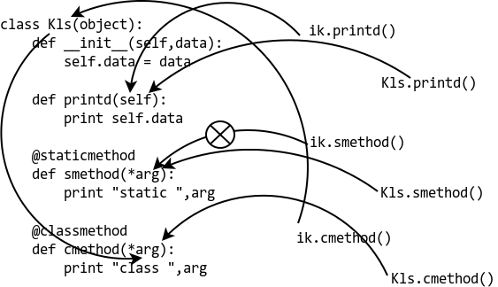

>所以，自己以为站得稳的，须要谨慎，免得跌倒。你们所遇见的试探，无非是人所能受的。神是信实的，必不叫你们受试探过于所能受的。在受试探的时候，总要给你们开一条出路，叫你们能忍受得住。(1 CORINTHIANS 10:12-13)

#类(5)

在前面几节讨论类的时候，经常要将类实例化，然后通过实例来调用类的方法（函数）。在此，把前面经常做的这类事情概括一下：

- 方法是类内部定义函数，只不过这个函数的第一个参数是self。（可以认为方法是类属性，但不是实例属性）
- 必须将类实例化之后，才能通过实例调用该类的方法。调用的时候在方法后面要跟括号（括号中默认有self参数，但是不写出来。）

通过实例调用方法（在前面曾用了一个不严谨的词语：实例方法），我们称这个方法**绑定**在实例上。

##调用绑定方法

前面一直在这样做。比如：

    class Person(object):
        def foo(self):
            pass
          
如果要调用Person.foo()方法，必须：

    pp = Person()    #实例化
    pp.foo()
    
这样就实现了方法和实例的绑定，于是通过`pp.foo()`即可调用该方法。

##调用非绑定方法

在[《类(4)》](./209.md)中，介绍了一个函数super。为了描述方便，把代码复制过来：

    #!/usr/bin/env python
    # coding=utf-8

    __metaclass__ = type

    class Person:
        def __init__(self):
            self.height = 160

        def about(self, name):
            print "{} is about {}".format(name, self.height)

    class Girl(Person):
        def __init__(self):
            super(Girl, self).__init__()
            self.breast = 90

        def about(self, name):
            print "{} is a hot girl, she is about {}, and her breast is {}".format(name, self.height, self.breast)
            super(Girl, self).about(name)

    if __name__ == "__main__":
        cang = Girl()
        cang.about("canglaoshi")

在子类Girl中，因为重写了父类的`__init__`方法，如果要调用父类该方法，在上节中不得不使用`super(Girl, self).__init__()`调用父类中因为子类方法重写而被遮蔽的同名方法。

其实，在子类中，父类的方法就是**非绑定方法**，因为在子类中，没有建立父类的实例，却要是用父类的方法。对于这种非绑定方法的调用，还有一种方式。不过这种方式现在已经较少是用了，因为有了super函数。为了方便读者看其它有关代码，还是要简要说明。

例如在上面代码中，在类Girl中想调用父类Person的初始化函数，则需要在子类中，写上这么一行：

    Person.__init__(self)
    
这不是通过实例调用的，而是通过类Person实现了对`__init__(self)`的调用。这就是调用非绑定方法的用途。但是，这种方法已经被super函数取代，所以，如果读者在编程中遇到类似情况，推荐使用super函数。

##静态方法和类方法

已知，类的方法第一个参数必须是self，并且如果要调用类的方法，必须将通过类的实例，即方法绑定实例后才能由实例调用。如果不绑定，一般在继承关系的类之间，可以用super函数等方法调用。

这里再介绍一种方法，这种方法的调用方式跟上述的都不同，这就是：静态方法和类方法。看代码：

    #!/usr/bin/env python
    # coding=utf-8

    __metaclass__ = type

    class StaticMethod:
        @staticmethod
        def foo():
            print "This is static method foo()."

    class ClassMethod:
        @classmethod
        def bar(cls):
            print "This is class method bar()."
            print "bar() is part of class:", cls.__name__

    if __name__ == "__main__":
        static_foo = StaticMethod()    #实例化
        static_foo.foo()               #实例调用静态方法
        StaticMethod.foo()             #通过类来调用静态方法
        print "********"
        class_bar = ClassMethod()
        class_bar.bar()
        ClassMethod.bar()

对于这部分代码，有一处非常特别，那就是包含了“@”符号。在python中：

- `@staticmethod`表示下面的方法是静态方法
- `@classmethod`表示下面的方法是类方法

一个一个来看。

先看静态方法，虽然名为静态方法，但也是方法，所以，依然用def语句来定义。需要注意的是文件名后面的括号内，没有self，这和前面定义的类中的方法是不同的，也正是因着这个不同，才给它另外取了一个名字叫做静态方法，否则不就“泯然众人矣”。如果没有self，那么也就无法访问实例变量、类和实例的属性了，因为它们都是借助self来传递数据的。

在看类方法，同样也具有一般方法的特点，区别也在参数上。类方法的参数也没有self，但是必须有cls这个参数。在类方法中，能够方法类属性，但是不能访问实例属性（读者可以自行设计代码检验之）。

简要明确两种方法。下面看调用方法。两种方法都可以通过实例调用，即绑定实例。也可以通过类来调用，即`StaticMethod.foo()`这样的形式，这也是区别一般方法的地方，一般方法必须用通过绑定实例调用。

上述代码运行结果：

    $ python 21001.py 
    This is static method foo().
    This is static method foo().
    ********
    This is class method bar().
    bar() is part of class: ClassMethod
    This is class method bar().
    bar() is part of class: ClassMethod

这是关于静态方法和类方法的简要介绍。

正当我思考如何讲解的更深入一点的时候，我想起了以往看过的一篇文章，觉得人家讲的非常到位。所以，不敢吝啬，更不敢班门弄斧，所以干醋把那篇文章恭恭敬敬的抄录于此。同时，读者从下面的文章中，也能对前面的知识复习一下。文章标题是：python中的staticmethod和classmethod的差异。原载：www.pythoncentral.io/difference-between-staticmethod-and-classmethod-in-python/。此地址需要你准备梯子才能浏览。后经国人翻译，地址是：http://www.wklken.me/posts/2013/12/22/difference-between-staticmethod-and-classmethod-in-python.html

以下是翻译文章：

###Class vs static methods in Python

这篇文章试图解释：什么事staticmethod/classmethod,并且这两者之间的差异.

staticmethod和classmethod均被作为装饰器，用作定义一个函数为"staticmethod"还是"classmethod"

如果想要了解Python装饰器的基础，可以看[这篇文章](http://www.pythoncentral.io/python-decorators-overview/)

###Simple, static and class methods

类中最常用到的方法是 实例方法(instance methods), 即，实例对象作为第一个参数传递给函数

例如，下面是一个基本的实例方法

    class Kls(object):
        def __init__(self, data):
            self.data = data

        def printd(self):
            print(self.data)

    ik1 = Kls('arun')
    ik2 = Kls('seema')

    ik1.printd()
    ik2.printd()
    
得到的输出:

    arun
    seema

调用关系图:

查看代码和图解:

>1/2 参数传递给函数

>3   self参数指向实例本身 

>4   我们不需要显式提供实例，解释器本身会处理

假如我们想仅实现类之间交互而不是通过实例？我们可以在类之外建立一个简单的函数来实现这个功能，但是将会使代码扩散到类之外，这个可能对未来代码维护带来问题。

例如：

    def get_no_of_instances(cls_obj):
        return cls_obj.no_inst

    class Kls(object):
        no_inst = 0

        def __init__(self):
            Kls.no_inst = Kls.no_inst + 1

    ik1 = Kls()
    ik2 = Kls()

    print(get_no_of_instances(Kls))

结果：

    2
    
###The Python @classmethod

现在我们要做的是在类里创建一个函数，这个函数参数是类对象而不是实例对象.

在上面那个实现中，如果要实现不获取实例,需要修改如下:

    def iget_no_of_instance(ins_obj):
        return ins_obj.__class__.no_inst

    class Kls(object):
        no_inst = 0

        def __init__(self):
            Kls.no_inst = Kls.no_inst + 1

    ik1 = Kls()
    ik2 = Kls()
    print iget_no_of_instance(ik1)

结果

    2

可以使用Python2.2引入的新特性，使用@classmethod在类代码中创建一个函数

    class Kls(object):
        no_inst = 0

        def __init__(self):
            Kls.no_inst = Kls.no_inst + 1

        @classmethod
        def get_no_of_instance(cls_obj):
            return cls_obj.no_inst

    ik1 = Kls()
    ik2 = Kls()

    print ik1.get_no_of_instance()
    print Kls.get_no_of_instance()

We get the following output:

    2
    2

###The Python @staticmethod

通常，有很多情况下一些函数与类相关，但不需要任何类或实例变量就可以实现一些功能.

比如设置环境变量，修改另一个类的属性等等.这种情况下，我们也可以使用一个函数，一样会将代码扩散到类之外（难以维护）

下面是一个例子:

    IND = 'ON'

    def checkind():
        return (IND == 'ON')

    class Kls(object):
        def __init__(self,data):
            self.data = data

        def do_reset(self):
            if checkind():
                print('Reset done for:', self.data)

        def set_db(self):
            if checkind():
                self.db = 'new db connection'
                print('DB connection made for:',self.data)

    ik1 = Kls(12)
    ik1.do_reset()
    ik1.set_db()

结果:

    Reset done for: 12
    DB connection made for: 12
  
现在我们使用@staticmethod, 我们可以将所有代码放到类中

    IND = 'ON'

    class Kls(object):
        def __init__(self, data):
            self.data = data

        @staticmethod
        def checkind():
            return (IND == 'ON')

        def do_reset(self):
            if self.checkind():
                print('Reset done for:', self.data)

        def set_db(self):
            if self.checkind():
                self.db = 'New db connection'
            print('DB connection made for: ', self.data)

    ik1 = Kls(12)
    ik1.do_reset()
    ik1.set_db()

得到的结果:

    Reset done for: 12
    DB connection made for: 12

###How @staticmethod and @classmethod are different

    class Kls(object):
        def __init__(self, data):
            self.data = data

        def printd(self):
            print(self.data)

        @staticmethod
        def smethod(*arg):
            print('Static:', arg)

        @classmethod
        def cmethod(*arg):
            print('Class:', arg)

调用

    >>> ik = Kls(23)
    >>> ik.printd()
    23
    >>> ik.smethod()
    Static: ()
    >>> ik.cmethod()
    Class: (<class '__main__.Kls'>,)
    >>> Kls.printd()
    TypeError: unbound method printd() must be called with Kls instance as first argument (got nothing instead)
    >>> Kls.smethod()
    Static: ()
    >>> Kls.cmethod()
    Class: (<class '__main__.Kls'>,)

图解
   

   
##文档字符串

在写程序的时候，必须要写必要的文字说明，没别的原因，除非你的代码写的非常容易理解，特别是各种变量、函数和类等的命名任何人都能够很容易理解，否则，文字说明是不可缺少的。

在函数、类或者文件开头的部分写文档字符串说明，一般采用三重引号。这样写的最大好处是能够用help()函数看。

    """This is python lesson"""

    def start_func(arg):
        """This is a function."""
        pass

    class MyClass:
        """Thi is my class."""
        def my_method(self,arg):
            """This is my method."""
            pass

这样的文档是必须的。

当然，在编程中，有不少地方要用“#”符号来做注释。一般用这个来注释局部。

------

[总目录](./index.md)&nbsp;&nbsp;&nbsp;|&nbsp;&nbsp;&nbsp;[上节：类(4)](./209.md)&nbsp;&nbsp;&nbsp;|&nbsp;&nbsp;&nbsp;[下节：类(6)](./211.md)

如果你认为有必要打赏我，请通过支付宝：**qiwsir@126.com**,不胜感激。