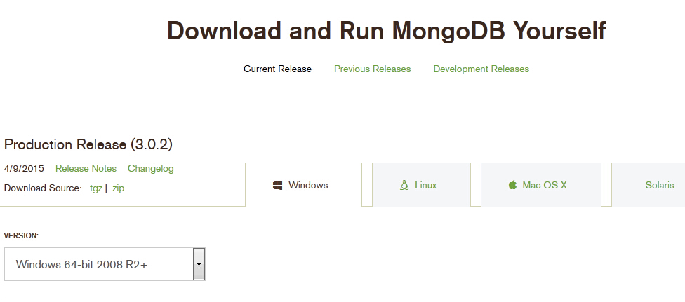

>大哉！敬虔的奥秘，无人不以为然，就是：神在肉身显现，被圣灵称义，被天使看见，被传于外邦，被世人信服，被接在荣耀里。(1 TIMOTHY 3:16)

#mongodb数据库(1)

MongoDB开始火了，这是时代发展的需要。为此，本教程也要涉及到如何用python来操作mongodb。考虑到读者对这种数据库可能比mysql之类的更陌生，所以，要用多一点的篇幅稍作介绍，当然，更完备的内容还是要去阅读专业的mongodb书籍。

mongodb是属于NoSql的。

NoSql，全称是 Not Only Sql,指的是非关系型的数据库。它是为了大规模web应用而生的，其特征诸如模式自由、支持简易复制、简单的API、大容量数据等等。

MongoDB是其一，选择它，主要是因为我喜欢，否则我不会列入我的教程。数说它的特点，可能是：

- 面向文档存储
- 对任何属性可索引
- 复制和高可用性
- 自动分片
- 丰富的查询
- 快速就地更新

也许还能列出更多，基于它的特点，擅长领域就在于：

- 大数据（太时髦了！以下可以都不看，就要用它了。）
- 内容管理和交付
- 移动和社交基础设施
- 用户数据管理
- 数据平台

##安装mongodb

先演示在ubuntu系统中的安装过程：

    sudo apt-key adv --keyserver hkp://keyserver.ubuntu.com:80 --recv 7F0CEB10
    echo 'deb http://downloads-distro.mongodb.org/repo/ubuntu-upstart dist 10gen' | sudo tee /etc/apt/sources.list.d/mongodb.list
    sudo apt-get update
    sudo apt-get install mongodb-10gen
    
如此就安装完毕。上述安装流程来自：[Install MongoDB](http://docs.mongodb.org/manual/tutorial/install-mongodb-on-ubuntu/)

如果你用的是其它操作系统，可以到官方网站下载安装程序：[http://www.mongodb.org/downloads](http://www.mongodb.org/downloads)，能满足各种操作系统。

>难免在安装过程中遇到问题，推荐几个资料，供参考：

>[window平台安装 MongoDB](http://www.w3cschool.cc/mongodb/mongodb-window-install.html)

>[NoSQL之【MongoDB】学习（一）：安装说明](http://www.cnblogs.com/zhoujinyi/archive/2013/06/02/3113868.html)

>[MongoDB 生产环境的安装与配置(Ubuntu)](https://ruby-china.org/topics/454)

>[在Ubuntu中安装MongoDB](http://blog.fens.me/linux-mongodb-install/)

>[在Ubuntu下进行MongoDB安装步骤](www.cnblogs.com/alexqdh/archive/2011/11/25/2263626.html)

##启动mongodb

安装完毕，就可以启动数据库。因为本教程不是专门讲数据库，所以，这里不设计数据库的详细讲解，请读者参考有关资料。下面只是建立一个简单的库，并且说明mongodb的基本要点，目的在于为后面用python来操作它做个铺垫。

执行`mongo`启动shell，显示的也是`>`，有点类似mysql的状态。在shell中，可以实现与数据库的交互操作。

在shell中，有一个全局变量db，使用哪个数据库，那个数据库就会被复制给这个全局变量db，如果那个数据库不存在，就会新建。

    > use mydb
    switched to db mydb
    > db
    mydb

除非向这个数据库中增加实质性的内容，否则它是看不到的。

    > show dbs;
    local	0.03125GB

向这个数据库增加点东西。mongodb的基本单元是文档，所谓文档，就类似与python中的字典，以键值对的方式保存数据。

    > book = {"title":"from beginner to master", "author":"qiwsir", "lang":"python"}
    {
    	"title" : "from beginner to master",
    	"author" : "qiwsir",
    	"lang" : "python"
    }
    > db.books.insert(book)
    > db.books.find()
    { "_id" : ObjectId("554f0e3cf579bc0767db9edf"), "title" : "from beginner to master", "author" : "qiwsir", "lang" : "python" }
    
db指向了数据库mydb，books是这个数据库里面的一个集合（类似mysql里面的表），向集合books里面插入了一个文档（文档对应mysql里面的记录）。“数据库、集合、文档”构成了mongodb数据库。

从上面操作，还发现一个有意思的地方，并没有类似create之类的命令，用到数据库，就通过`use xxx`，如果不存在就建立；用到集合，就通过`db.xxx`来使用，如果没有就建立。可以总结为“随用随取随建立”。是不是简单的有点出人意料。

    > show dbs
    local	0.03125GB
    mydb	0.0625GB

当有了充实内容之后，也看到刚才用到的数据库mydb了。

在mongodb的shell中，可以对数据进行“增删改查”等操作。但是，我们的目的是用python来操作，所以，还是把力气放在后面用。

##安装pymongo

要用python来驱动mongodb，必须要安装驱动模块，即pymongo，这跟操作mysql类似。安装方法，我最推荐如下：

    $ sudo pip install pymongo
    
如果顺利，就会看到最后的提示：

    Successfully installed pymongo
    Cleaning up...

安装好之后，进入到python的交互模式里面：

    >>> import pymongo

说明模块没有问题。

##连接mongodb

既然python驱动mongdb的模块pymongo业已安装完毕，接下来就是连接，也就是建立连接对象。

    >>> pymongo.Connection("localhost",27017)
    Traceback (most recent call last):
      File "<stdin>", line 1, in <module>
    AttributeError: 'module' object has no attribute 'Connection'

报错！我在去年做的项目中，就是这样做的，并且网上查看很多教程都是这么连接。

但是，经验主义害死人，如果：

    >>> dir(pymongo)
    ['ALL', 'ASCENDING', 'CursorType', 'DESCENDING', 'DeleteMany', 'DeleteOne', 'GEO2D', 'GEOHAYSTACK', 'GEOSPHERE', 'HASHED', 'IndexModel', 'InsertOne', 'MAX_SUPPORTED_WIRE_VERSION', 'MIN_SUPPORTED_WIRE_VERSION', 'MongoClient', 'MongoReplicaSetClient', 'OFF', 'ReadPreference', 'ReplaceOne', 'ReturnDocument', 'SLOW_ONLY', 'TEXT', 'UpdateMany', 'UpdateOne', 'WriteConcern', '__builtins__', '__doc__', '__file__', '__name__', '__package__', '__path__', '_cmessage', 'auth', 'bulk', 'client_options', 'collection', 'command_cursor', 'common', 'cursor', 'cursor_manager', 'database', 'errors', 'get_version_string', 'has_c', 'helpers', 'ismaster', 'message', 'mongo_client', 'mongo_replica_set_client', 'monitor', 'monotonic', 'network', 'operations', 'periodic_executor', 'pool', 'read_preferences', 'response', 'results', 'server', 'server_description', 'server_selectors', 'server_type', 'settings', 'son_manipulator', 'ssl_context', 'ssl_support', 'thread_util', 'topology', 'topology_description', 'uri_parser', 'version', 'version_tuple', 'write_concern']

瞪大我的那双浑浊迷茫布满血丝渴望惊喜的眼睛，透过近视镜的玻璃片，怎么也找不到Connection()这个方法。原来，刚刚安装的pymongo变了，“他变了”。

不过，我发现了它：MongoClient()

    >>> client = pymongo.MongoClient("localhost", 27017)
    
很好。python已经和mongodb建立了连接。

刚才已经建立了一个数据库mydb，并且在这个库里面有一个集合books，于是：

    >>> db = client.mydb

或者

    >>> db = client['mydb']
    
获得数据库mydb，并赋值给变量db（这个变量不是mongodb的shell中的那个db，此处的db就是python中一个寻常的变量）。

    >>> db.collection_names()
    [u'system.indexes', u'books']

查看集合，发现了我们已经建立好的那个books，于是在获取这个集合，并赋值给一个变量books：

    >>> books = db["books"]

或者

    >>> books = db.books
    
接下来，就可以操作这个集合中的具体内容了。

###编辑
    
刚刚的books所引用的是一个mongodb的集合对象，它就跟前面学习过的其它对象一样，有一些方法供我们来驱使。

    >>> type(books)
    <class 'pymongo.collection.Collection'>

    >>> dir(books)
    ['_BaseObject__codec_options', '_BaseObject__read_preference', '_BaseObject__write_concern', '_Collection__create', '_Collection__create_index', '_Collection__database', '_Collection__find_and_modify', '_Collection__full_name', '_Collection__name', '__call__', '__class__', '__delattr__', '__dict__', '__doc__', '__eq__', '__format__', '__getattr__', '__getattribute__', '__getitem__', '__hash__', '__init__', '__iter__', '__module__', '__ne__', '__new__', '__next__', '__reduce__', '__reduce_ex__', '__repr__', '__setattr__', '__sizeof__', '__str__', '__subclasshook__', '__weakref__', '_command', '_count', '_delete', '_insert', '_socket_for_primary_reads', '_socket_for_reads', '_socket_for_writes', '_update', 'aggregate', 'bulk_write', 'codec_options', 'count', 'create_index', 'create_indexes', 'database', 'delete_many', 'delete_one', 'distinct', 'drop', 'drop_index', 'drop_indexes', 'ensure_index', 'find', 'find_and_modify', 'find_one', 'find_one_and_delete', 'find_one_and_replace', 'find_one_and_update', 'full_name', 'group', 'index_information', 'initialize_ordered_bulk_op', 'initialize_unordered_bulk_op', 'inline_map_reduce', 'insert', 'insert_many', 'insert_one', 'list_indexes', 'map_reduce', 'name', 'next', 'options', 'parallel_scan', 'read_preference', 'reindex', 'remove', 'rename', 'replace_one', 'save', 'update', 'update_many', 'update_one', 'with_options', 'write_concern']

这么多方法不会一一介绍，只是按照“增删改查”的常用功能，介绍几种。读者可以使用help()去查看每一种方法的使用说明。

    >>> books.find_one()
    {u'lang': u'python', u'_id': ObjectId('554f0e3cf579bc0767db9edf'), u'author': u'qiwsir', u'title': u'from beginner to master'}

提醒读者注意的是，如果你熟悉了mongodb的shell中的命令，跟pymongo中的方法稍有差别，比如刚才这个，在mongodb的shell中是这样子的：

    > db.books.findOne()
    {
    	"_id" : ObjectId("554f0e3cf579bc0767db9edf"),
    	"title" : "from beginner to master",
    	"author" : "qiwsir",
    	"lang" : "python"
    }

请注意区分。

目前在集合books中，有一个文档，还想再增加，于是插入一条：

**新增和查询**

    >>> b2 = {"title":"physics", "author":"Newton", "lang":"english"}
    >>> books.insert(b2)
    ObjectId('554f28f465db941152e6df8b')

成功地向集合中增加了一个文档。得看看结果（我们就是充满好奇心的小孩子，我记得女儿小时候，每个给她照相，拍了一张，她总要看一看。现在我们似乎也是这样，如果不看看，总觉得不放心），看看就是一种查询。

    >>> books.find().count()
    2
    
这是查看当前集合有多少个文档的方式，返回值为2，则说明有两条文档了。还是要看看内容。

    >>> books.find_one()
    {u'lang': u'python', u'_id': ObjectId('554f0e3cf579bc0767db9edf'), u'author': u'qiwsir', u'title': u'from beginner to master'}

这个命令就不行了，因为它只返回第一条。必须要：
    
    >>> for i in books.find():
    ...     print i
    ... 
    {u'lang': u'python', u'_id': ObjectId('554f0e3cf579bc0767db9edf'), u'author': u'qiwsir', u'title': u'from beginner to master'}
    {u'lang': u'english', u'title': u'physics', u'_id': ObjectId('554f28f465db941152e6df8b'), u'author': u'Newton'}

在books引用的对象中有find()方法，它返回的是一个可迭代对象，包含着集合中所有的文档。

由于文档是键值对，也不一定每条文档都要结构一样，比如，也可以插入这样的文档进入集合。

    >>> books.insert({"name":"Hertz"})
    ObjectId('554f2b4565db941152e6df8c')
    >>> for i in books.find():
    ...     print i
    ... 
    {u'lang': u'python', u'_id': ObjectId('554f0e3cf579bc0767db9edf'), u'author': u'qiwsir', u'title': u'from beginner to master'}
    {u'lang': u'english', u'title': u'physics', u'_id': ObjectId('554f28f465db941152e6df8b'), u'author': u'Newton'}
    {u'_id': ObjectId('554f2b4565db941152e6df8c'), u'name': u'Hertz'}

如果有多个文档，想一下子插入到集合中（在mysql中，可以实现多条数据用一条命令插入到表里面，还记得吗？忘了看[上一节](./231.md)），可以这么做：

    >>> n1 = {"title":"java", "name":"Bush"}
    >>> n2 = {"title":"fortran", "name":"John Warner Backus"}
    >>> n3 = {"title":"lisp", "name":"John McCarthy"}
    >>> n = [n1, n2, n3]
    >>> n
    [{'name': 'Bush', 'title': 'java'}, {'name': 'John Warner Backus', 'title': 'fortran'}, {'name': 'John McCarthy', 'title': 'lisp'}]
    >>> books.insert(n)
    [ObjectId('554f30be65db941152e6df8d'), ObjectId('554f30be65db941152e6df8e'), ObjectId('554f30be65db941152e6df8f')]

这样就完成了所谓的批量插入，查看一下文档条数：

    >>> books.find().count()
    6

但是，要提醒读者，批量插入的文档大小是有限制的，网上有人说不要超过20万条，有人说不要超过16MB，我没有测试过。在一般情况下，或许达不到上线，如果遇到极端情况，就请读者在使用时多注意了。
    
如果要查询，除了通过循环之外，能不能按照某个条件查呢？比如查找`'name'='Bush'`的文档：

    >>> books.find_one({"name":"Bush"})
    {u'_id': ObjectId('554f30be65db941152e6df8d'), u'name': u'Bush', u'title': u'java'}

对于查询结果，还可以进行排序：

    >>> for i in books.find().sort("title", pymongo.ASCENDING):
    ...     print i
    ... 
    {u'_id': ObjectId('554f2b4565db941152e6df8c'), u'name': u'Hertz'}
    {u'_id': ObjectId('554f30be65db941152e6df8e'), u'name': u'John Warner Backus', u'title': u'fortran'}
    {u'lang': u'python', u'_id': ObjectId('554f0e3cf579bc0767db9edf'), u'author': u'qiwsir', u'title': u'from beginner to master'}
    {u'_id': ObjectId('554f30be65db941152e6df8d'), u'name': u'Bush', u'title': u'java'}
    {u'_id': ObjectId('554f30be65db941152e6df8f'), u'name': u'John McCarthy', u'title': u'lisp'}
    {u'lang': u'english', u'title': u'physics', u'_id': ObjectId('554f28f465db941152e6df8b'), u'author': u'Newton'}

这是按照"title"的值的升序排列的，注意sort()中的第二个参数，意思是升序排列。如果按照降序，就需要将参数修改为`pymongo.DESCEDING`，也可以指定多个排序键。

    >>> for i in books.find().sort([("name",pymongo.ASCENDING),("name",pymongo.DESCENDING)]):
    ...     print i
    ... 
    {u'_id': ObjectId('554f30be65db941152e6df8e'), u'name': u'John Warner Backus', u'title': u'fortran'}
    {u'_id': ObjectId('554f30be65db941152e6df8f'), u'name': u'John McCarthy', u'title': u'lisp'}
    {u'_id': ObjectId('554f2b4565db941152e6df8c'), u'name': u'Hertz'}
    {u'_id': ObjectId('554f30be65db941152e6df8d'), u'name': u'Bush', u'title': u'java'}
    {u'lang': u'python', u'_id': ObjectId('554f0e3cf579bc0767db9edf'), u'author': u'qiwsir', u'title': u'from beginner to master'}
    {u'lang': u'english', u'title': u'physics', u'_id': ObjectId('554f28f465db941152e6df8b'), u'author': u'Newton'}

**更新**

对于已有数据，进行更新，是数据库中常用的操作。比如，要更新name为Hertz那个文档：

    >>> books.update({"name":"Hertz"}, {"$set": {"title":"new physics", "author":"Hertz"}})
    {u'updatedExisting': True, u'connectionId': 4, u'ok': 1.0, u'err': None, u'n': 1}
    >>> books.find_one({"author":"Hertz"})
    {u'title': u'new physics', u'_id': ObjectId('554f2b4565db941152e6df8c'), u'name': u'Hertz', u'author': u'Hertz'}

在更新的时候，用了一个`$set`修改器，它可以用来指定键值，如果键不存在，就会创建。

关于修改器，不仅仅是这一个，还有别的呢。

|修改器|描述|
|----|----|
|$set|用来指定一个键的值。如果不存在则创建它|
|$unset|完全删除某个键|
|$inc|增加已有键的值，不存在则创建（只能用于增加整数、长整数、双精度浮点数）
|$push|数组修改器只能操作值为数组，存在key在值末尾增加一个元素，不存在则创建一个数组|

**删除**

删除可以用remove()方法：

    >>> books.remove({"name":"Bush"})
    {u'connectionId': 4, u'ok': 1.0, u'err': None, u'n': 1}
    >>> books.find_one({"name":"Bush"})
    >>> 

这是将那个文档全部删除。当然，也可以根据mongodb的语法规则，写个条件，按照条件删除。

**索引**

索引的目的是为了让查询速度更快，当然，在具体的项目开发中，要视情况而定是否建立索引。因为建立索引也是有代价的。

    >>> books.create_index([("title", pymongo.DESCENDING),])
    u'title_-1'

我这里仅仅是对pymongo模块做了一个非常简单的介绍，在实际使用过程中，上面知识是很有限的，所以需要读者根据具体应用场景再结合mongodb的有关知识去尝试新的语句。

------

[总目录](./index.md)&nbsp;&nbsp;&nbsp;|&nbsp;&nbsp;&nbsp;[上节：mysql数据库(2)](./231.md)&nbsp;&nbsp;&nbsp;|&nbsp;&nbsp;&nbsp;[下节：sqlite数据库](./233.md)

如果你认为有必要打赏我，请通过支付宝：**qiwsir@126.com**,不胜感激。